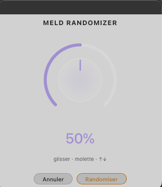

# Soulreaktive — Meld Randomizer

I always wish Ableton would add a random clickable button to their Instruments & Fx devices (not when they are racked), now it's possible with this 'lil extension. This is another cool starting point, when you find something sounding good, you can go further in sound designing Meld, or simply save this state as a new preset.

You can choose a percentage of randomness from 0 to 100%. Initial start is 50%.

## Installation

Double-click the `.ablx` file with Live Beta open (Developer Mode enabled in Preferences → Extensions).

## Usage

Right-click on a MIDI track (clip view or arrangement view) containing a Meld → search in extension menu: ***Soulreaktive - Meld Randomizer*** → Start Randomize Meld

## What gets randomized

- All oscillator parameters (A and B engines)
- Filters — 75% chance of being ON
- Envelopes, LFOs, modulation
- Engine A and B — 75% chance of being ON (at least one always active)

## What stays locked

- Volume — forced to -12dB
- Keytracking — always ON
- Limiter — always ON
- Mono/Poly — always Poly
- Transpose/Octave — untouched
